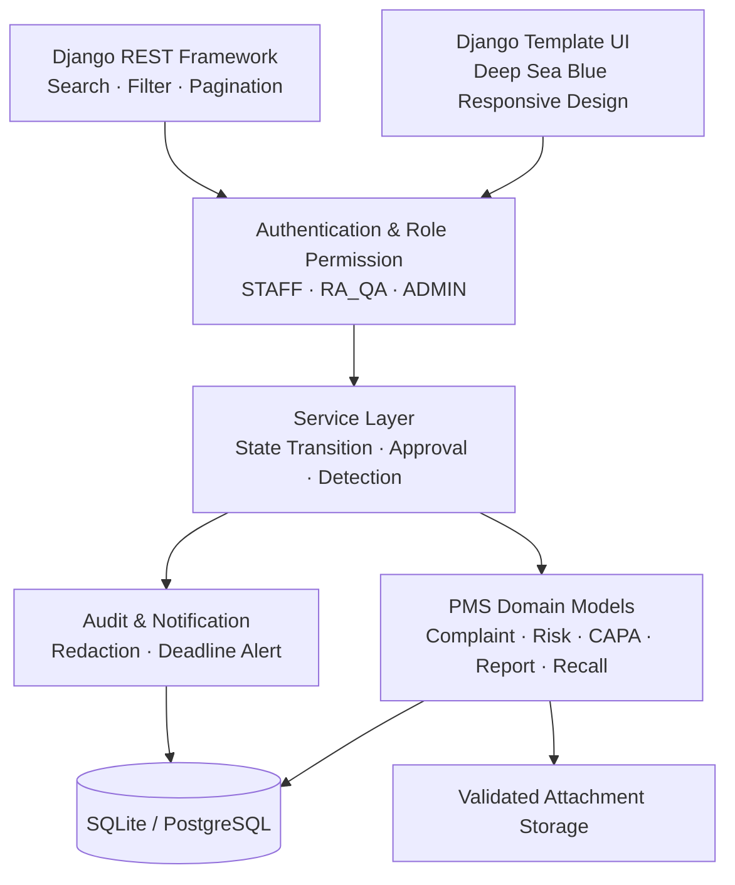
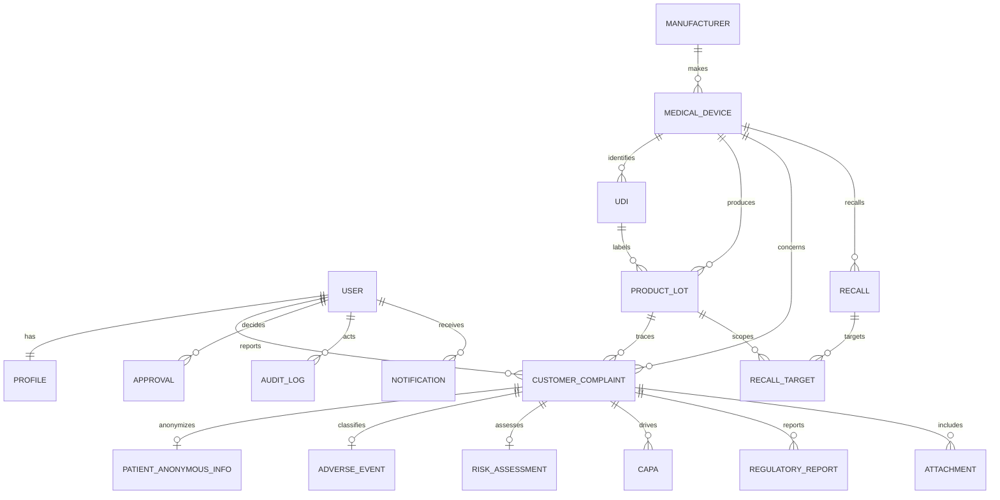

# MedWatch PMS · 의료기기 PMS·리콜 관리 시스템

의료기기 출시 후 고객 불만, 이상사례, 위험평가, CAPA, 규제보고, 리콜과 회수율을 하나의 추적 가능한 흐름으로 관리하는 **취업 포트폴리오용 Django 5 데모**입니다. 실제 식약처 규정 준수, 법정 보고 기한 또는 의료 판단을 자동 보장하는 시스템이 아닙니다.

> **한 줄 소개**: 흩어진 시판 후 안전관리 업무를 역할 기반 상태 머신과 감사 가능한 승인 흐름으로 연결한 의료기기 RA·QA 포트폴리오 프로젝트

## 프로젝트 요약

| 항목 | 내용 |
|---|---|
| 프로젝트 유형 | 의료기기 PMS(Post-Market Surveillance)·리콜 관리 웹 서비스 |
| 주요 사용자 | 고객 대응 STAFF, RA_QA 검토자, ADMIN 승인자 |
| 핵심 문제 | 불만부터 리콜까지 분리된 업무와 판단 근거를 하나의 사건 이력으로 추적 |
| 핵심 가치 | 서버 권한, 순차 상태 전이, 위험평가, CAPA·규제보고·리콜 연결, 승인 스냅샷, 감사 로그 |
| 백엔드 | Python 3.12, Django 5, Django REST Framework |
| 데이터베이스 | SQLite 개발환경, PostgreSQL 운영환경 |
| 프런트엔드 | Django Template, 반응형 자체 CSS, Chart.js |
| 배포 기반 | Docker, Docker Compose, GitHub Actions |
| 자동화 검증 | Django TestCase 27개, system check, 마이그레이션 검사 |

## 빠른 데모 시나리오

면접이나 포트폴리오 시연에서는 다음 순서로 약 3분 안에 핵심 기능을 보여줄 수 있습니다.

1. `staff`로 로그인해 제품·UDI·LOT를 지정한 고객 불만을 접수합니다.
2. STAFF 계정에서는 자신이 등록한 사건만 보이는 것을 확인합니다.
3. `raqa`로 로그인해 사건 상세 통합 워크스페이스를 엽니다.
4. 심각도와 발생 가능성을 입력해 위험점수와 등급이 자동 계산되는 것을 확인합니다.
5. HIGH 이상 사건에서 CAPA 없이 다음 단계로 갈 수 없는 서버 검증을 확인합니다.
6. 규제보고 판단 체크리스트와 조사 결과를 저장합니다.
7. 필요 시 리콜 검토안을 만들고 LOT·시리얼 대상과 회수율을 확인합니다.
8. 관리자 승인 단계에서 사건 버전과 관련 자료가 스냅샷으로 고정되는 것을 확인합니다.
9. `admin`으로 승인 또는 사유를 포함한 반려를 처리합니다.
10. 감사 로그와 포트폴리오용 규제보고서·리콜 종료 보고서를 인쇄합니다.

## 주요 화면

| 화면 | 핵심 내용 |
|---|---|
| 로그인 | Django 인증, 성공·실패 감사 로그 |
| 역할별 대시보드 | 불만, 기한 초과, 고위험 사건, CAPA, 보고서, 리콜 지표와 차트 |
| 사건 통합 워크스페이스 | 사건 개요, 위험평가, CAPA, 규제보고, 리콜, 승인 상태를 한 화면에서 처리 |
| 의료기기 상세 | 제조사, 모델, 위험등급, UDI·LOT·불만·리콜 연결 현황 |
| UDI·LOT 상세 | 제품 추적성, 시리얼번호, 제조·사용기한, 유통 수량 |
| 이상사례 상세 | 연결 사건, 익명 환자 코드, 중대성, 결과와 서술 |
| CAPA 상세 | 근본 원인, 시정·예방조치, 담당자, 기한과 상태 |
| 리콜 상세 | 대상 LOT·시리얼, 승인, 수량, 회수율, 종료 보고서 |
| 사용자 관리 | 역할과 활성 상태 변경, 관리자 자기 잠금 방지 |
| 감사 로그 | 사용자, 행동, 대상, 전후 값, IP와 일시 |

## 시스템 아키텍처



### 계층별 책임

- `models.py`: 데이터 무결성, 위험점수, 회수율, UDI·제품 관계와 수량 검증
- `services.py`: 상태 전이, 승인 스냅샷, 역할 검증, 반복 불만 탐지, 감사·알림
- `api.py`: 역할별 queryset, REST 권한, 검색·필터·정렬·페이지네이션
- `views.py`: 서버 렌더링 화면과 POST 작업의 권한·객체 접근 통제
- `forms.py` / `serializers.py`: 화면과 API 입력 검증
- `middleware.py`: 로그인 성공·실패 감사 기록

## 핵심 설계 결정

### 1. 상태 문자열 변경이 아닌 명시적 상태 머신

사건 상태는 임의로 저장하지 않고 `TRANSITIONS`에 정의된 다음 단계만 허용합니다. 위험평가, CAPA, 규제보고 체크리스트, 관리자 승인 등 단계별 선행조건도 서비스 계층에서 검사합니다. 따라서 버튼을 숨기는 프런트엔드 제어를 우회해도 잘못된 전이가 차단됩니다.

### 2. 역할과 객체 소유권을 함께 검증

STAFF는 단순히 읽기 권한을 받는 것이 아니라 `reporter=request.user`인 사건만 조회할 수 있습니다. 연결된 이상사례와 첨부파일도 동일한 사건 queryset을 통해 범위가 제한됩니다. RA_QA와 ADMIN은 업무에 필요한 전체 사건을 조회합니다.

### 3. 승인 시점 데이터 스냅샷

승인 요청에는 사건 버전, 제품, UDI, LOT, 위험점수·등급, CAPA·규제보고·리콜 ID를 JSON으로 저장합니다. 이후 데이터가 변경되더라도 승인자가 어떤 상태를 검토했는지 추적할 수 있는 구조입니다.

### 4. 환자정보 최소화

이름, 주민등록번호, 전화번호 필드 자체를 만들지 않았습니다. 무작위 익명 환자 코드와 제한된 비식별 정보만 저장하며, 직접 식별정보를 암시하는 메모는 모델 검증에서 차단합니다.

### 5. 규칙과 규제 판단의 분리

위험등급 및 반복 불만 임계치는 데모 내부 규칙으로 명시하고 환경변수로 조정할 수 있게 했습니다. 실제 관할 규제 판단이나 법정 기한을 자동 보장한다고 표현하지 않습니다.

## 요구사항 추적표

| 요구사항 | 구현 위치 | 검증 방식 |
|---|---|---|
| 역할별 접근 권한 | `permissions.py`, `services.role`, 역할별 views | 역할·접근 테스트 |
| 타인 사건 접근 차단 | `visible_complaints()` | 화면 404 및 API 범위 테스트 |
| 위험 자동 계산 | `RiskAssessment.save()` | 점수·등급 테스트 |
| 순차 상태 전이 | `transition_complaint()` | 잘못된 전이·선행조건 테스트 |
| 반복 불만 탐지 | `recurrent_warning()` | LOT 임계치 테스트 |
| CAPA 연결 | `CAPA`, 통합 워크스페이스 | HIGH 사건 CAPA 필수 테스트 |
| 규제보고 판단 | `RegulatoryReport.checklist` | 보고 단계 선행조건 테스트 |
| 리콜 수량·회수율 | `Recall.clean()`, `recovery_rate` | 초과 수량·회수율 테스트 |
| 리콜 대상 | `RecallTarget`, REST API | 제품·LOT 및 합계 검증 |
| 승인·반려 | `Approval`, `decide_approval()` | 반려 사유·승인 게이트 테스트 |
| 승인 스냅샷 | `Approval.snapshot` | 버전·제품 스냅샷 테스트 |
| 감사 로그 | `audit()`, middleware | 민감정보 마스킹 테스트 |
| 첨부 보안 | `Attachment`, serializer | 확장자·크기 테스트 |
| 익명 환자 | `PatientAnonymousInfo` | 직접 식별정보 차단 테스트 |
| 보고서 | `report_print.html`, `recall_print.html` | HTML 인쇄/PDF 저장 |

## 위험평가 예시

| 심각도 | 발생 가능성 | 점수 | 등급 | 시스템 조치 |
|---:|---:|---:|---|---|
| 2 | 2 | 4 | LOW | 일반 검토 |
| 3 | 2 | 6 | MEDIUM | 추세 모니터링 |
| 4 | 3 | 12 | HIGH | CAPA 검토 필수 |
| 5 | 4 | 20 | CRITICAL | 관리자·RA_QA 긴급 경고 |

`위험점수 = 심각도 × 발생 가능성`이며 본 기준은 시연용 내부 규칙입니다.

## 기획 목적과 포트폴리오 포인트

- RA/QA 업무를 데이터 모델, 상태 머신, 승인 통제, 감사 추적으로 구체화
- 단순 CRUD를 넘어 위험점수 자동 계산, 반복 불만 신호, 회수율 및 기한 알림 구현
- 화면에서 버튼만 숨기지 않고 View/API/queryset/service 계층에서 역할과 객체 소유권을 검증
- 환자는 익명 코드만 저장하고 파일·로그·환경변수까지 보안 경계를 설계
- SQLite 개발환경과 PostgreSQL/Docker 운영형 구성을 함께 제공

## 주요 기능

- 로그인 사용자 전용 RA 업무 도우미: 사건 상태 조회, 고위험·기한 초과 사건 요약, 위험등급 기준, CAPA·리콜·PMS 절차 안내
- 챗봇은 외부 AI 전송 없이 로컬 규칙과 사용자 권한 범위의 데이터만 사용하며, 질문 원문을 감사 로그에 남기지 않음
- STAFF는 본인 사건만 조회하고 RA_QA·ADMIN은 업무 범위 전체를 조회하며, 직접 식별정보 입력은 서버에서 차단
- STAFF 본인 불만 접수·조회, RA_QA 검토·위험평가·CAPA·보고·리콜, ADMIN 최종 승인·종료·감사 조회
- 의료기기, 제조사, UDI, LOT, 시리얼번호 추적
- 심각도 × 발생 가능성에 따른 LOW/MEDIUM/HIGH/CRITICAL 자동 분류
- 동일 유형+LOT(30일/3건), 동일 유형+제품(90일/5건), CRITICAL 반복 신호
- 파일 확장자 및 5MB 기본 크기 제한, UUID 저장명, 원본명 분리
- 리콜 목표·실회수 수량 검증과 회수율 계산
- 규제 검토 보고서 HTML 인쇄/PDF 저장, OpenAPI/Swagger 문서
- 검색·필터·정렬·페이지네이션 REST API, Chart.js 대시보드
- 로그인/CRUD/상태/승인/보고서/다운로드 감사 로그
- 사건 상세 통합 워크스페이스에서 위험평가 → CAPA → 규제보고 → 리콜 → 관리자 승인 처리
- 승인 요청 시 사건 버전, 제품·UDI·LOT, 위험등급, 연결 CAPA·보고서·리콜을 JSON 스냅샷으로 보존
- 제품·UDI·LOT·이상사례·CAPA·리콜 상세 화면과 리콜 종료 결과 인쇄
- ADMIN 사용자 역할·활성 상태 변경, 리콜 승인·반려 사유·종료 보고서 관리
- cron 또는 Celery 없이도 실행 가능한 `notify_deadlines` 관리 명령

## 업무 흐름


허용 전이는 `pms/services.py`의 `TRANSITIONS`에 정의되어 있고 서비스가 순서를 검증합니다. 조치 완료·종료는 ADMIN만 가능합니다.

통합 워크스페이스는 위험평가 미작성, HIGH 이상 사건의 CAPA 미등록, 규제보고 체크리스트 미작성, 관리자 승인 미완료 상태에서 다음 단계 진행을 서버에서 차단합니다. 반려된 사건은 새 버전의 승인 스냅샷으로 재요청할 수 있습니다.

## ERD



## 권한 구조

| 기능 | STAFF | RA_QA | ADMIN |
|---|---:|---:|---:|
| 불만/이상사례 접수 | 본인 사건 | 가능 | 가능 |
| 불만 조회 | 본인만 | 전체 | 전체 |
| 위험평가·CAPA·규제보고·리콜 | 불가 | 가능 | 가능 |
| 상태 검토 | 불가 | 가능 | 가능 |
| 최종 승인·종료 | 불가 | 불가 | 가능 |
| 사용자·감사 로그 | 불가 | 불가 | 가능 |

## 로컬 설치 및 실행

Python 3.12를 권장합니다.

```bash
python -m venv .venv
# Windows: .venv\Scripts\activate
# macOS/Linux: source .venv/bin/activate
pip install -r requirements.txt
copy .env.example .env  # macOS/Linux: cp .env.example .env
python manage.py migrate
python manage.py runserver
```

브라우저에서 `http://127.0.0.1:8000/`을 엽니다. API 문서는 `/api/docs/`, Django 관리 화면은 `/admin/`입니다. `.env`를 자동 로드하는 패키지를 일부러 강제하지 않았으므로 로컬 셸에서 값을 내보내거나 Docker Compose의 `env_file`을 사용합니다. 개발 시 `DEBUG=True`, 운영 시 반드시 `False`를 사용하세요.

### 환경변수

| 이름 | 설명 / 기본값 |
|---|---|
| `SECRET_KEY` | 운영 필수. 긴 무작위 값 |
| `DEBUG` | 기본 `False` |
| `ALLOWED_HOSTS` | 쉼표 구분 호스트 |
| `DB_ENGINE` | `sqlite` 또는 `postgresql` |
| `DB_NAME/USER/PASSWORD/HOST/PORT` | PostgreSQL 접속 정보 |
| `SECURE_COOKIES`, `SECURE_SSL_REDIRECT` | HTTPS 운영 시 `True` |
| `SECURE_HSTS_SECONDS` | HTTPS 검증 후 운영 HSTS 기간; 기본 `0` |
| `SECURE_HSTS_PRELOAD` | preload 요건을 이해하고 충족한 경우에만 `True` |
| `MAX_UPLOAD_BYTES` | 기본 5,242,880 bytes |
| `LOT_WINDOW_DAYS`, `LOT_THRESHOLD` | LOT 반복 신호 규칙 |
| `DEVICE_WINDOW_DAYS`, `DEVICE_THRESHOLD` | 제품 반복 신호 규칙 |
| `DEMO_PASSWORD` | 데모 계정 생성 시 필수 |

실제 보고 기한 및 규칙은 환경변수 또는 향후 관리자 설정 모델로 교체할 수 있게 설정과 서비스 로직을 분리했습니다.

## 마이그레이션과 데모 데이터

```bash
python manage.py migrate
# PowerShell
$env:DEMO_PASSWORD="직접-정한-안전한-비밀번호"
python manage.py seed_demo
# bash
DEMO_PASSWORD='직접-정한-안전한-비밀번호' python manage.py seed_demo
```

생성 계정은 `admin`(ADMIN), `raqa`(RA_QA), `staff`(STAFF)입니다. 비밀번호는 소스에 없으며 `DEMO_PASSWORD`가 없으면 명령이 실패합니다. 샘플 환자 데이터에는 직접 식별정보가 없습니다.

기한 알림은 스케줄러에서 다음 명령을 매일 실행할 수 있습니다.

```bash
python manage.p��w��$z{-���jם��&��f�&��6fR�6��֗C�f�6R���&��6�����C�6�����C��&��FWf�6S�6�����B�FWf�6S��&���v�W#�&WVW7B�W6W#��&��gV���6�Vₓ��&��6fR���VF�B�&WVW7B�W6W"�$5$TDR"��&��gFW#ײ'F&vWE�V�F�G�#��&��F&vWE�V�F�G�ғ��W76vW2�7V66W72�&WVW7B�.�j�����(�j�X���B�9��K�h�ȫ^�����B�"��V�6S��W76vW2�W'&�"�&WVW7B�f�&��W'&�'2�5�FW�B����&WGW&�&VF�&V7B�&6�����B�v�&�76R"������v���&WV�&V@�&�&WV�&V@�&WV�&U��5@�FVb&�f��&WVW7B�&WVW7B�����6�����C�vWE��&�V7E��%�CB�7W7F��W$6�����B������G'��&WVW7E�6�����E�&�f†6�����B�&WVW7B�W6W"�&WVW7B��UD�vWB�%$T��DU�DE""����W76vW2�7V66W72�&WVW7B�.�H�j���ȫ��ێ��BɩN�*��h�ȫ^�����B�"��W�6WBfƖFF���W'&�"2W�3��W76vW2�W'&�"�&WVW7B�""����W�2��W76vW2���&WGW&�&VF�&V7B�&6�����B�v�&�76R"������v���&WV�&V@�&WV�&U��5@�FVb&�f��FV6�FR�&WVW7B���&�f�������b&��R�&WVW7B�W6W"��&�f��R�&��R�DԔ�&�6RW&֗76���FV�V@�&�f��vWE��&�V7E��%�CB�&�f����&�f����6��FV�E�G�S�$7W7F��W$6�����B"��&�V7E��C����G'��FV6�FU�&�f†&�f��&WVW7B�W6W"�&WVW7B��5B�vWB�&FV6�6���"��&WVW7B��5B�vWB�'&V6��"�""��&WVW7B��UD�vWB�%$T��DU�DE""����W76vW2�7V66W72�&WVW7B�.ȫ��ۂ�+�	^��B���^�h�ȫ^�����B�"��W�6WBfƖFF���W'&�"2W�3��W76vW2�W'&�"�&WVW7B�""����W�2��W76vW2���&WGW&�&VF�&V7B�&6�����B�v�&�76R"������v���&WV�&V@�FVbFWf�6U�Ɨ7B�&WVW7B��&WGW&�&V�FW"�&WVW7B�'�2��&�V7E�Ɨ7B�F��"Dz'F�F�R#�.�َ�8Ϋ���"�&�FV�2#��VF�6�FWf�6R��&�V7G2�6V�V7E�&V�FVB�&��Vf7GW&W""��&�VFW'2#��.�	��(���R"�.����ۂ"�.�	���*�%�Ґ���v���&WV�&V@�FVbFWf�6U�FWF�‡&WVW7B����&WGW&�&V�FW"�&WVW7B�'�2�FWf�6U�FWF���F��"Dz&�FV�#�vWE��&�V7E��%�CB��VF�6�FWf�6R��&�V7G2�6V�V7E�&V�FVB�&��Vf7GW&W""������Ґ���v���&WV�&V@�&�&WV�&V@�FVbFWf�6U�7&VFR�&WVW7B���f�&��FWf�6Tf�&҇&WVW7B��5B�"���R���bf�&��5�fƖB����&��f�&��6fR���VF�B�&WVW7B�W6W"�$5$TDR"��&��gFW#ײ&��FV���V�&W"#��&����FV���V�&W'ғ�&WGW&�&VF�&V7B�&FWf�6R�FWF��"��&�����&WGW&�&V�FW"�&WVW7B�'�2�f�&��F��"Dz&f�&�#�f�&��'F�F�R#�.�َ�8Ϋ����;��'Ґ���v���&WV�&V@�FVb��E�Ɨ7B�&WVW7B��&WGW&�&V�FW"�&WVW7B�'�2���E�Ɨ7B�F��"Dz&�FV�2#�&�GV7D��B��&�V7G2�6V�V7E�&V�FVB�&FWf�6R"�'VF�"�Ґ���v���&WV�&V@�FVb��E�FWF�‡&WVW7B����&WGW&�&V�FW"�&WVW7B�'�2���E�FWF���F��"Dz&�FV�#�vWE��&�V7E��%�CB�&�GV7D��B��&�V7G2�6V�V7E�&V�FVB�&FWf�6R"�'VF�"������Ґ���v���&WV�&V@�&�&WV�&V@�FVb��E�7&VFR�&WVW7B���f�&����Df�&҇&WVW7B��5B�"���R���bf�&��5�fƖB����&��f�&��6fR���VF�B�&WVW7B�W6W"�$5$TDR"��&��gFW#ײ&��E��V�&W"#��&����E��V�&W'ғ�&WGW&�&VF�&V7B�&��B�FWF��"��&�����&WGW&�&V�FW"�&WVW7B�'�2�f�&��F��"Dz&f�&�#�f�&��'F�F�R#�%TD�+t��L+~ȹκj��k��;��'Ґ���v���&WV�&V@�FVbGfW'6U�Ɨ7B�&WVW7B��&WGW&�&V�FW"�&WVW7B�'�2�GfW'6U�Ɨ7B�F��"Dz&�FV�2#�GfW'6TWfV�B��&�V7G2�f��FW"�6�����E�����f�6�&�U�6�����G2�&WVW7B�W6W"���6V�V7E�&V�FVB�&6�����B"�Ґ���v���&WV�&V@�FVbGfW'6U�7&VFR�&WVW7B���f�&��GfW'6TWfV�Df�&҇&WVW7B��5B�"���R��f�&��f�V�G5�&6�����B%��VW'�6WC�f�6�&�U�6�����G2�&WVW7B�W6W"���b&��R�&WVW7B�W6W"���&�f��R�&��R�5Ddc�f�&��f�V�G5�'F�V�B%��VW'�6WC�F�V�D�����W4��f���&�V7G2�f��FW"�6�����E��&W�'FW#�&WVW7B�W6W"���bf�&��5�fƖB����&��f�&��6fR���VF�B�&WVW7B�W6W"�$5$TDR"��&��gFW#ײ&WfV�E�G�R#��&��WfV�E�G�Wғ�&WGW&�&VF�&V7B�&GfW'6R�FWF��"��&�����&WGW&�&V�FW"�&WVW7B�'�2�f�&��F��"Dz&f�&�#�f�&��'F�F�R#�.��N�8�*κ�;��'Ґ���v���&WV�&V@�FVbGfW'6U�FWF�‡&WVW7B����&WGW&�&V�FW"�&WVW7B�'�2�GfW'6U�FWF���F��"Dz&�FV�#�vWE��&�V7E��%�CB�GfW'6TWfV�B��&�V7G2�f��FW"�6�����E�����f�6�&�U�6�����G2�&WVW7B�W6W"���6V�V7E�&V�FVB�&6�����B"�'F�V�B"������Ґ���v���&WV�&V@�&�&WV�&V@�FVb6�Ɨ7B�&WVW7B��&WGW&�&V�FW"�&WVW7B�'�2�6�Ɨ7B�F��"Dz&�FV�2#�4��&�V7G2�6V�V7E�&V�FVB�&6�����B"�&�v�W""�Ґ���v���&WV�&V@�&�&WV�&V@�FVb6�FWF�‡&WVW7B����&WGW&�&V�FW"�&WVW7B�'�2�6�FWF���F��"Dz&�FV�#�vWE��&�V7E��%�CB�4��&�V7G2�6V�V7E�&V�FVB�&6�����B"�&�v�W""������Ґ���v���&WV�&V@�&�&WV�&V@�FVb&V6���Ɨ7B�&WVW7B��&WGW&�&V�FW"�&WVW7B�'�2�&V6���Ɨ7B�F��"Dz&�FV�2#�&V6����&�V7G2�6V�V7E�&V�FVB�&FWf�6R"�Ґ���v���&WV�&V@�&�&WV�&V@�FVb&V6���FWF�‡&WVW7B����&WGW&�&V�FW"�&WVW7B�'�2�&V6���FWF���F��"Dz&�FV�#�vWE��&�V7E��%�CB�&V6����&�V7G2�6V�V7E�&V�FVB�&FWf�6R"�&�v�W""�&6�����B"������Ґ���v���&WV�&V@�&WV�&U��5@�FVb&V6���F֖��7F���&WVW7B������b&��R�&WVW7B�W6W"��&�f��R�&��R�DԔ�&�6RW&֗76���FV�V@��&��vWE��&�V7E��%�CB�&V6��������7F����&WVW7B��5B�vWB�&7F���"��&Vf�&Sײ&&�f��7FGW2#��&��&�f��7FGW2�'&�w&W75�7FGW2#��&��&�w&W75�7FGW7Т&V6���&WVW7B��5B�vWB�&FV6�6����&V6��"�""��7G&�����b7F�����&&�fR#��&��&�f��7FGW3�&V6���&�f��$�dTC��&��FV6�6����&V6���&V6��VƖb7F�����'&V�V7B#���b��B&V6���W76vW2�W'&�"�&WVW7B�.�j�����	��
B�*�����B�XNȉ���^�����B�"��&WGW&�&VF�&V7B�'&V6���FWF��"�����&��&�f��7FGW3�&V6���&�f��$T�T5DTC��&��FV6�6����&V6���&V6��VƖb7F�����&6��6R#���&��6��7W&U�&W�'C�&WVW7B��5B�vWB�&6��7W&U�&W�'B"��&��6��7W&U�&W�'B��7G&�����b�&��&�f��7FGW2�&V6���&�f��$�dTB�"��B�&��6��7W&U�&W�'B�7G&�����W76vW2�W'&�"�&WVW7B�.ȫ��ێ�;��(^�8��;N�:�IΫ���kN�[��j������B�(^�8��Zȉ���ȫ^�����B�"��&WGW&�&VF�&V7B�'&V6���FWF��"�����&��&�w&W75�7FGW3�&V6���&�w&W72�4��4T@�V�6S�&�6RfƖFF���W'&�"�.�xɹ�Y��x�X���B�j�����˙���^�����B�"���&��6fR���VF�B�&WVW7B�W6W"�%$T4���"�7F����WW"����&��&Vf�&RDz&&�f��7FGW2#��&��&�f��7FGW2�'&�w&W75�7FGW2#��&��&�w&W75�7FGW7ғ��W76vW2�7V66W72�&WVW7B�.�j�����8�9κ[��8�+��h�ȫ^�����B�"��&WGW&�&VF�&V7B�'&V6���FWF��"������v���&WV�&V@�&�&WV�&V@�FVb&V6���&��B�&WVW7B������&��vWE��&�V7E��%�CB�&V6����&�V7G2�6V�V7E�&V�FVB�&FWf�6R"�&�v�W""�&6�����B"�������VF�B�&WVW7B�W6W"�%$U�%E�tT�U$DR"��&���&WGW&�&V�FW"�&WVW7B�'�2�&V6���&��B�F��"Dz&�FV�#��&�Ґ���v���&WV�&V@�&�&WV�&V@�FVb&W�'E�Ɨ7B�&WVW7B��&WGW&�&V�FW"�&WVW7B�'�2�&W�'E�Ɨ7B�F��"Dz&�FV�2#�&VwV�F�'�&W�'B��&�V7G2�6V�V7E�&V�FVB�&6�����B"�Ґ���v���&WV�&V@�&�&WV�&V@�FVb&W�'E�&��B�&WVW7B������&��vWE��&�V7E��%�CB�&VwV�F�'�&W�'B������VF�B�&WVW7B�W6W"�%$U�%E�tT�U$DR"��&���&WGW&�&V�FW"�&WVW7B�'�2�&W�'E�&��B�F��"Dz&�FV�#��&�Ґ���v���&WV�&V@�FVb��F�f�6F���2�&WVW7B��&WGW&�&V�FW"�&WVW7B�'�2���F�f�6F���2�F��"Dz&�FV�2#���F�f�6F�����&�V7G2�f��FW"�W6W#�&WVW7B�W6W"�Ґ���v���&WV�&V@�FVb&�f�2�&WVW7B����b&��R�&WVW7B�W6W"��&�f��R�&��R�DԔ�&�6RW&֗76���FV�V@�&WGW&�&V�FW"�&WVW7B�'�2�&�f�2�F��"Dz&�FV�2#�&�f���&�V7G2�f��FW"�FV6�6����%T�D��r"�Ґ���v���&WV�&V@�FVbVF�E���w2�&WVW7B����b&��R�&WVW7B�W6W"��&�f��R�&��R�DԔ�&�6RW&֗76���FV�V@�&WGW&�&V�FW"�&WVW7B�'�2�VF�G2�F��"Dz&�FV�2#�VF�D��r��&�V7G2�6V�V7E�&V�FVB�&7F�""���#�Ґ���v���&WV�&V@�FVbW6W'2�&WVW7B����b&��R�&WVW7B�W6W"��&�f��R�&��R�DԔ�&�6RW&֗76���FV�V@�&WGW&�&V�FW"�&WVW7B�'�2�W6W'2�F��"Dz&�FV�2#�&�f��R��&�V7G2�6V�V7E�&V�FVB�'W6W""�Ґ���v���&WV�&V@�&WV�&U��5@�FVbW6W%�WFFR�&WVW7B������b&��R�&WVW7B�W6W"��&�f��R�&��R�DԔ�&�6RW&֗76���FV�V@�&�f��S�vWE��&�V7E��%�CB�&�f��R��&�V7G2�6V�V7E�&V�FVB�'W6W""�������&Vf�&Sײ'&��R#�&�f��R�&��R�&7F�fR#�&�f��R�W6W"�5�7F�fWӲ&WVW7FVC�&WVW7B��5B�vWB�'&��R"���b&WVW7FVB��B��&�f��R�&��R�f�VW3��W76vW2�W'&�"�&WVW7B�.Ɋλ	N�[N�x�X����z��Z��^�����B�"��&WGW&�&VF�&V7B�'W6W"�Ɨ7B"���b&�f��R�W6W%��C��&WVW7B�W6W"�B�B�&WVW7FVB�&�f��R�&��R�DԔ��"&WVW7B��5B�vWB�&�5�7F�fR"��&��"���W76vW2�W'&�"�&WVW7B�.وN����H�j�����Ⱥ�قDԔ��h��Y���N�)�ٙ��K�8�9θ�B�[N�	��Zȉ��xnȫ^�����B�"��&WGW&�&VF�&V7B�'W6W"�Ɨ7B"��&�f��R�&��S�&WVW7FVC�&�f��R�6fR�WFFU�f�V�G3ղ'&��R%ғ�&�f��R�W6W"�5�7F�fS�&WVW7B��5B�vWB�&�5�7F�fR"���&��#�&�f��R�W6W"�6fR�WFFU�f�V�G3ղ&�5�7F�fR%ғ�VF�B�&WVW7B�W6W"�%UDDR"�&�f��R�&Vf�&RDz'&��R#�&�f��R�&��R�&7F�fR#�&�f��R�W6W"�5�7F�fWғ��W76vW2�7V66W72�&WVW7B�.�*�ɪ����h��Y���B�8�+��h�ȫ^�����B�"��&WGW&�&VF�&V7B�'W6W"�Ɨ7B"����v���&WV�&V@�FVb76�7F�E�6�B�&WVW7B���6��fW'6F����76�7F�D6��fW'6F�����&�V7G2�f��FW"�W6W#�&WVW7B�W6W"Ɨ5�7F�fS�G'VR��f�'7B����b��B6��fW'6F���6��fW'6F����76�7F�D6��fW'6F�����&�V7G2�7&VFR�W6W#�&WVW7B�W6W"���b&WVW7B��WF��C��%�5B#��G'���VW7F����fƖFFU�VW7F���&WVW7B��5B�vWB�&�W76vR"�����FV�B�&W7��6S��7vW%�VW7F���&WVW7B�W6W"�VW7F��␢76�7F�D�W76vR��&�V7G2�7&VFR�6��fW'6F����6��fW'6F����&��S�76�7F�D�W76vR�&��R�U4U"�6��FV�C�VW7F���Ɩ�FV�C֖�FV�B��76�7F�D�W76vR��&�V7G2�7&VFR�6��fW'6F����6��fW'6F����&��S�76�7F�D�W76vR�&��R�54�5D�B�6��FV�C�&W7��6RƖ�FV�C֖�FV�B��6��fW'6F����6fR�WFFU�f�V�G3ղ'WFFVE�B%ғ�VF�B�&WVW7B�W6W"�$54�5D�E�TU%�"�6��fW'6F����gFW#ײ&��FV�B#���FV�B�&�V�wF�#��V�VW7F����Ɨ�&WVW7B��UD�vWB�%$T��DU�DE""���W�6WBf�VTW'&�"2W�3��W76vW2�W'&�"�&WVW7B�7G"�W�2���&WGW&�&VF�&V7B�&76�7F�B�6�B"��&WGW&�&V�FW"�&WVW7B�'�2�76�7F�E�6�B�F��"Dz&6��fW'6F���#�6��fW'6F����&6�E��W76vW2#�6��fW'6F�����W76vW2��‚����Ґ���v���&WV�&V@�&WV�&U��5@�FVb76�7F�E��Wr�&WVW7B���76�7F�D6��fW'6F�����&�V7G2�f��FW"�W6W#�&WVW7B�W6W"Ɨ5�7F�fS�G'VR��WFFR��5�7F�fS�f�6R��76�7F�D6��fW'6F�����&�V7G2�7&VFR�W6W#�&WVW7B�W6W"��&WGW&�&VF�&V7B�&76�7F�B�6�B"����v���&WV�&V@�FVbGF6��V�E�F�v���B�&WVW7B������&��vWE��&�V7E��%�CB�GF6��V�B�����6�����E�����f�6�&�U�6�����G2�&WVW7B�W6W"���VF�B�&WVW7B�W6W"�$ED4��T�E�D�t���B"��&���&WGW&�f��U&W7��6R��&��f��R��V�'&""��5�GF6��V�C�G'VR�f��V��S��&���&�v������R�"&GF6��V�B"����v���&WV�&V@�&WV�&U��5@�FVbGF6��V�E�W��B�&WVW7B�����6�����C�vWE��&�V7E��%�CB�f�6�&�U�6�����G2�&WVW7B�W6W"�������f�&��GF6��V�Df�&҇&WVW7B��5B�&WVW7B�d��U2���b��Bf�&��5�fƖB���&�6RfƖFF���W'&�"�f�&��W'&�'2�5��6�ₒ���&��f�&��6fR�6��֗C�f�6R���&��6�����C�6�����C��&��W��FVE�'��&WVW7B�W6W#��&���&�v������S�F���&��f��R���R����S��&��gV���6�Vₓ��&��6fR���VF�B�&WVW7B�W6W"�$5$TDR"��&��gFW#ײ&�&�v������R#��&���&�v������Wғ�&WGW&�&VF�&V7B�&6�����B�v�&�76R"���