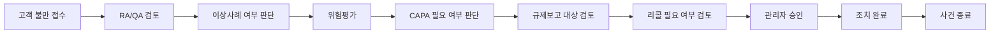
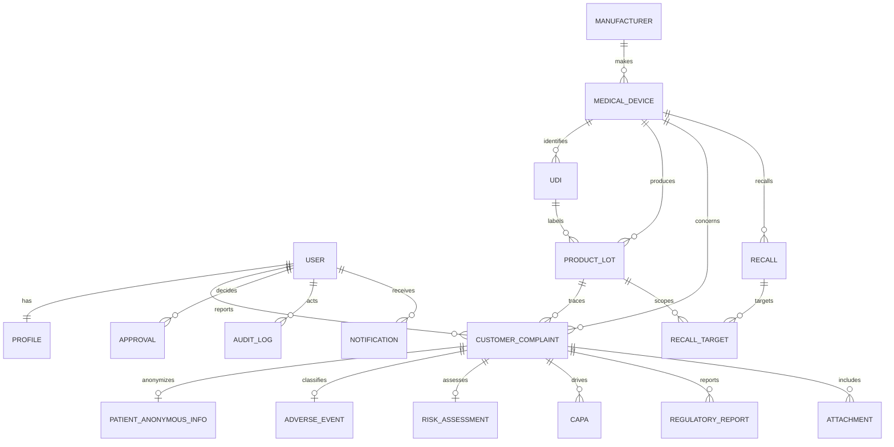

# MedWatch PMS · 의료기기 PMS·리콜 관리 시스템

의료기기 출시 후 고객 불만, 이상사례, 위험평가, CAPA, 규제보고, 리콜과 회수율을 하나의 추적 가능한 흐름으로 관리하는 **취업 포트폴리오용 Django 5 데모**입니다. 실제 식약처 규정 준수, 법정 보고 기한 또는 의료 판단을 자동 보장하는 시스템이 아닙니다.

## 기획 목적과 포트폴리오 포인트

- RA/QA 업무를 데이터 모델, 상태 머신, 승인 통제, 감사 추적으로 구체화
- 단순 CRUD를 넘어 위험점수 자동 계산, 반복 불만 신호, 회수율 및 기한 알림 구현
- 화면에서 버튼만 숨기지 않고 View/API/queryset/service 계층에서 역할과 객체 소유권을 검증
- 환자는 익명 코드만 저장하고 파일·로그·환경변수까지 보안 경계를 설계
- SQLite 개발환경과 PostgreSQL/Docker 운영형 구성을 함께 제공

## 주요 기능

- STAFF 본인 불만 접수·조회, RA_QA 검토·위험평가·CAPA·보고·리콜, ADMIN 최종 승인·종료·감사 조회
- 의료기기, 제조사, UDI, LOT, 시리얼번호 추적
- 심각도 × 발생 가능성에 따른 LOW/MEDIUM/HIGH/CRITICAL 자동 분류
- 동일 유형+LOT(30일/3건), 동일 유형+제품(90일/5건), CRITICAL 반복 신호
- 파일 확장자 및 5MB 기본 크기 제한, UUID 저장명, 원본명 분리
- 리콜 목표·실회수 수량 검증과 회수율 계산
- 규제 검토 보고서 HTML 인쇄/PDF 저장, OpenAPI/Swagger 문서
- 검색·필터·정렬·페이지네이션 REST API, Chart.js 대시보드
- 로그인/CRUD/상태/승인/보고서/다운로드 감사 로그
- cron 또는 Celery 없이도 실행 가능한 `notify_deadlines` 관리 명령

## 업무 흐름



허용 전이는 `pms/services.py`의 `TRANSITIONS`에 정의되어 있고 서비스가 순서를 검증합니다. 조치 완료·종료는 ADMIN만 가능합니다.

## ERD



## 권한 구조

| 기능 | STAFF | RA_QA | ADMIN |
|---|---:|---:|---:|
| 불만/이상사례 접수 | 본인 사건 | 가능 | 가능 |
| 불만 조회 | 본인만 | 전체 | 전체 |
| 위험평가·CAPA·규제보고·리콜 | 불가 | 가능 | 가능 |
| 상태 검토 | 불가 | 가능 | 가능 |
| 최종 승인·종료 | 불가 | 불가 | 가능 |
| 사용자·감사 로그 | 불가 | 불가 | 가능 |

## 로컬 설치 및 실행

Python 3.12를 권장합니다.

```bash
python -m venv .venv
# Windows: .venv\Scripts\activate
# macOS/Linux: source .venv/bin/activate
pip install -r requirements.txt
copy .env.example .env  # macOS/Linux: cp .env.example .env
python manage.py migrate
python manage.py runserver
```

브라우저에서 `http://127.0.0.1:8000/`을 엽니다. API 문서는 `/api/docs/`, Django 관리 화면은 `/admin/`입니다. `.env`를 자동 로드하는 패키지를 일부러 강제하지 않았으므로 로컬 셸에서 값을 내보내거나 Docker Compose의 `env_file`을 사용합니다. 개발 시 `DEBUG=True`, 운영 시 반드시 `False`를 사용하세요.

### 환경변수

| 이름 | 설명 / 기본값 |
|---|---|
| `SECRET_KEY` | 운영 필수. 긴 무작위 값 |
| `DEBUG` | 기본 `False` |
| `ALLOWED_HOSTS` | 쉼표 구분 호스트 |
| `DB_ENGINE` | `sqlite` 또는 `postgresql` |
| `DB_NAME/USER/PASSWORD/HOST/PORT` | PostgreSQL 접속 정보 |
| `SECURE_COOKIES`, `SECURE_SSL_REDIRECT` | HTTPS 운영 시 `True` |
| `SECURE_HSTS_SECONDS` | HTTPS 검증 후 운영 HSTS 기간; 기본 `0` |
| `SECURE_HSTS_PRELOAD` | preload 요건을 이해하고 충족한 경우에만 `True` |
| `MAX_UPLOAD_BYTES` | 기본 5,242,880 bytes |
| `LOT_WINDOW_DAYS`, `LOT_THRESHOLD` | LOT 반복 신호 규칙 |
| `DEVICE_WINDOW_DAYS`, `DEVICE_THRESHOLD` | 제품 반복 신호 규칙 |
| `DEMO_PASSWORD` | 데모 계정 생성 시 필수 |

실제 보고 기한 및 규칙은 환경변수 또는 향후 관리자 설정 모델로 교체할 수 있게 설정과 서비스 로직을 분리했습니다.

## 마이그레이션과 데모 데이터

```bash
python manage.py migrate
# PowerShell
$env:DEMO_PASSWORD="직접-정한-안전한-비밀번호"
python manage.py seed_demo
# bash
DEMO_PASSWORD='직접-정한-안전한-비밀번호' python manage.py seed_demo
```

생성 계정은 `admin`(ADMIN), `raqa`(RA_QA), `staff`(STAFF)입니다. 비밀번호는 소스에 없으며 `DEMO_PASSWORD`가 없으면 명령이 실패합니다. 샘플 환자 데이터에는 직접 식별정보가 없습니다.

기한 알림은 스케줄러에서 다음 명령을 매일 실행할 수 있습니다.

```bash
python manage.py notify_deadlines
```

## 테스트

```bash
python manage.py check
python manage.py test -v 2
python manage.py check --deploy
```

역할별 권한, 타인 사건 차단, 위험 계산, 잘못된 전이, 반복 불만, 회수율/수량, 승인·반려, 감사 마스킹, 파일 검증, API 비인증, 익명 환자 규칙을 테스트합니다.

## Docker / PostgreSQL

`.env.example`을 `.env`로 복사하고 `SECRET_KEY`, `DB_PASSWORD`, `ALLOWED_HOSTS`를 변경한 뒤 실행합니다.

```bash
docker compose up --build
docker compose exec web python manage.py seed_demo
```

웹은 8000 포트에 열립니다. PostgreSQL과 업로드 파일은 named volume에 보존됩니다. Redis/Celery 없이 핵심 기능이 작동하며, 대규모 배포에서는 `notify_deadlines`를 Celery Beat 작업으로 교체할 수 있습니다.

## REST API

기본 경로는 `/api/`이며 세션 인증과 Basic 인증을 지원합니다. 주요 리소스:

- `/api/devices/`, `/api/udis/`, `/api/lots/`
- `/api/complaints/`, `/api/adverse-events/`, `/api/risks/`
- `/api/capas/`, `/api/recalls/`, `/api/reports/`
- `/api/approvals/`, `/api/notifications/`, `/api/audits/`
- 상태 전이: `POST /api/complaints/{id}/transition/` 본문 `{"status":"REVIEW"}`
- 승인 결정: `POST /api/approvals/{id}/decide/` 본문 `{"decision":"REJECTED","reason":"자료 보완"}`

예시:

```bash
curl -u raqa:비밀번호 'http://127.0.0.1:8000/api/complaints/?status=REVIEW&search=센서&ordering=-reported_on'
```

오류는 `{"success": false, "error": {"code": "...", "detail": ...}}` 형태입니다.

## 보안 고려사항

- Django CSRF 미들웨어와 자동 HTML escaping, `X_FRAME_OPTIONS=DENY`
- 화면·API·객체 queryset에 서버 권한 적용; STAFF는 본인이 등록한 불만만 조회
- 업로드 허용 확장자(pdf/png/jpg/jpeg/txt/csv), 크기 제한, UUID 저장 경로
- 비밀번호·토큰·세션·환자 코드 등 감사 로그 제외
- SECRET_KEY/DB 자격증명 환경변수화, `.env`와 DB/미디어 Git 제외
- 운영 Secure Cookie·HTTPS redirect 선택 가능
- 환자 이름, 주민등록번호, 전화번호 필드 자체가 없고 익명 코드만 사용

확장자 검사는 콘텐츠 무해성을 보장하지 않습니다. 운영 환경에서는 MIME/매직바이트 검사, 악성코드 스캔, 객체 스토리지 격리, 다운로드 시 `Content-Security-Policy`와 별도 도메인을 추가해야 합니다. 감사 로그는 애플리케이션 DB에 있으므로 규제 수준의 불변 저장소/WORM은 아닙니다.

## 규제·의료 면책 및 한계

이 프로젝트의 위험등급, 반복 불만 임계치, 체크리스트와 보고서는 **포트폴리오 시연을 위한 내부 데모 규칙**입니다. 실제 MFDS 또는 타 관할 규정, 법정 양식, 보고 시한, 임상 판단을 대체하지 않습니다. 실제 사용 전 관할 규정 검토, 품질시스템 밸리데이션, 전자서명·기록 보존 요구, 개인정보 영향평가가 필요합니다.

현재 데모는 범용 객체 승인을 단순 참조(`content_type`, `object_id`)로 표현하고 PDF는 브라우저의 인쇄/PDF 저장을 사용합니다. 완전한 규제 제출 연동, 전자서명, 불변 감사원장, 백신 스캔, 다국가 기한 엔진은 포함하지 않습니다.

## 향후 개선 과제

- 관리자 UI에서 버전 관리되는 관할별 보고 규칙/기한 설정
- Celery·Redis 기반 알림, 이메일 및 에스컬레이션
- PostgreSQL trigram/분류 모델을 이용한 유사도 보조(사람의 검토 유지)
- object-level permission과 조직/사이트 다중 테넌시
- WeasyPrint 기반 서버 PDF, 전자서명, 승인 스냅샷
- S3 호환 스토리지, MIME/악성코드 검사, 감사 로그 외부 불변 보관
- API 토큰/OIDC, CSP, rate limiting, observability와 백업 복구 훈련

## 프로젝트 구조

```text
config/                 Django 설정·URL·WSGI
pms/models.py           16개 핵심 도메인 모델
pms/services.py         상태 전이·승인·반복 신호·감사·알림
pms/api.py              DRF ViewSet과 역할별 queryset
pms/views.py            서버 렌더링 화면과 인쇄 보고서
pms/management/commands 데모 데이터·기한 알림
pms/tests.py            핵심 도메인/보안/API 테스트
static/css/app.css       Deep Sea Blue 반응형 디자인
Dockerfile / compose     PostgreSQL 배포형 구성
.github/workflows/ci.yml GitHub Actions 검사
```
