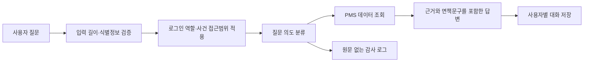
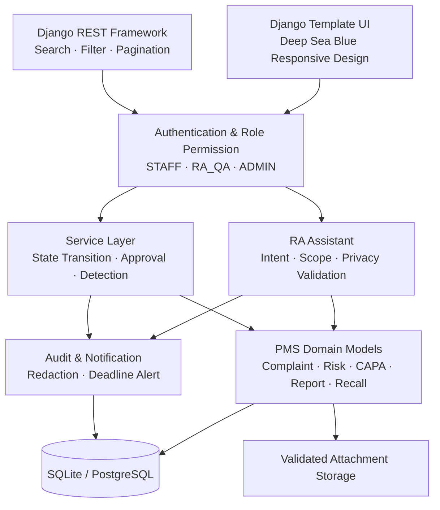
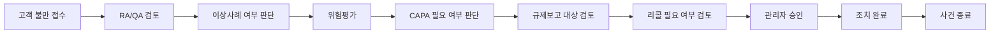
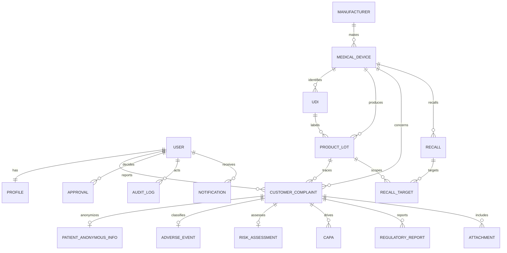

# MedWatch PMS · 의료기기 PMS·리콜 관리 시스템

의료기기 출시 후 고객 불만, 이상사례, 위험평가, CAPA, 규제보고, 리콜과 회수율을 하나의 추적 가능한 흐름으로 관리하는 **취업 포트폴리오용 Django 5 데모**입니다. 실제 식약처 규정 준수, 법정 보고 기한 또는 의료 판단을 자동 보장하는 시스템이 아닙니다.

> **한 줄 소개**: 흩어진 시판 후 안전관리 업무를 역할 기반 상태 머신과 감사 가능한 승인 흐름으로 연결한 의료기기 RA·QA 포트폴리오 프로젝트

## 프로젝트 요약

| 항목 | 내용 |
|---|---|
| 프로젝트 유형 | 의료기기 PMS(Post-Market Surveillance)·리콜 관리 웹 서비스 |
| 주요 사용자 | 고객 대응 STAFF, RA_QA 검토자, ADMIN 승인자 |
| 핵심 문제 | 불만부터 리콜까지 분리된 업무와 판단 근거를 하나의 사건 이력으로 추적 |
| 핵심 가치 | 서버 권한, 순차 상태 전이, 위험평가, CAPA·규제보고·리콜 연결, 승인 스냅샷, 감사 로그 |
| 백엔드 | Python 3.12, Django 5, Django REST Framework |
| 데이터베이스 | SQLite 개발환경, PostgreSQL 운영환경 |
| 프런트엔드 | Django Template, 반응형 자체 CSS, Chart.js |
| 배포 기반 | Docker, Docker Compose, GitHub Actions |
| 자동화 검증 | Django TestCase 27개, system check, 마이그레이션 검사 |

## 빠른 데모 시나리오

면접이나 포트폴리오 시연에서는 다음 순서로 약 3분 안에 핵심 기능을 보여줄 수 있습니다.

1. `staff`로 로그인해 제품·UDI·LOT를 지정한 고객 불만을 접수합니다.
2. STAFF 계정에서는 자신이 등록한 사건만 보이는 것을 확인합니다.
3. `raqa`로 로그인해 사건 상세 통합 워크스페이스를 엽니다.
4. 심각도와 발생 가능성을 입력해 위험점수와 등급이 자동 계산되는 것을 확인합니다.
5. HIGH 이상 사건에서 CAPA 없이 다음 단계로 갈 수 없는 서버 검증을 확인합니다.
6. 규제보고 판단 체크리스트와 조사 결과를 저장합니다.
7. 필요 시 리콜 검토안을 만들고 LOT·시리얼 대상과 회수율을 확인합니다.
8. 관리자 승인 단계에서 사건 버전과 관련 자료가 스냅샷으로 고정되는 것을 확인합니다.
9. `admin`으로 승인 또는 사유를 포함한 반려를 처리합니다.
10. 감사 로그와 포트폴리오용 규제보고서·리콜 종료 보고서를 인쇄합니다.

## RA 전용 챗봇

로그인 후 상단의 **RA 도우미** 메뉴 또는 모든 업무 화면 우측 하단의 **RA 챗봇** 버튼으로 실행합니다. 직접 주소는 `/assistant/`입니다. 이 기능은 외부 생성형 AI API를 호출하지 않는 로컬 규칙 기반 도우미로, 데모 데이터와 현재 사용자의 접근 권한 범위 안에서만 답변합니다.

### 지원 질문

| 질문 유형 | 예시 | 응답 내용 |
|---|---|---|
| 고위험 사건 | `고위험 사건 현황 알려줘` | HIGH·CRITICAL 사건번호, 제목, 상태 요약 |
| 기한 초과 | `기한 초과 사건 보여줘` | 완료되지 않은 기한 초과 사건 목록 |
| 사건 상태 | `CMP-1 상태 알려줘` | 현재 상태, 위험등급, 담당 업무 안내 |
| CAPA | `진행 중 CAPA 알려줘` | 연결 사건과 CAPA 진행 현황 |
| 리콜 | `리콜 회수율 보여줘` | 리콜별 회수 수량과 회수율 |
| 위험 기준 | `위험등급 계산 기준 알려줘` | 심각도 × 발생 가능성과 등급 기준 |
| 업무 절차 | `PMS 업무 흐름 알려줘` | 불만 접수부터 승인·종료까지 순서 |

### 권한과 개인정보 보호

- STAFF 질문에는 본인이 접수한 사건만 포함됩니다.
- RA_QA와 ADMIN은 각 역할에서 허용된 전체 업무 범위를 조회합니다.
- 대화는 로그인 사용자별로 분리되며 다른 사용자의 대화를 조회할 수 없습니다.
- 이름·전화번호·주민등록번호처럼 직접 식별 가능한 정보가 포함된 질문은 서버에서 거부합니다.
- 감사 로그에는 질문 원문 대신 의도 분류와 글자 수만 저장합니다.
- 챗봇 답변은 업무 참고용이며 최종 규제 판단과 의료 판단은 담당자가 검토해야 합니다.

### 챗봇 처리 흐름



## 주요 화면

| 화면 | 핵심 내용 |
|---|---|
| 로그인 | Django 인증, 성공·실패 감사 로그 |
| 역할별 대시보드 | 불만, 기한 초과, 고위험 사건, CAPA, 보고서, 리콜 지표와 차트 |
| RA 전용 챗봇 | 사건 상태·고위험·기한·CAPA·리콜 현황과 업무 절차 질의 |
| 사건 통합 워크스페이스 | 사건 개요, 위험평가, CAPA, 규제보고, 리콜, 승인 상태를 한 화면에서 처리 |
| 의료기기 상세 | 제조사, 모델, 위험등급, UDI·LOT·불만·리콜 연결 현황 |
| UDI·LOT 상세 | 제품 추적성, 시리얼번호, 제조·사용기한, 유통 수량 |
| 이상사례 상세 | 연결 사건, 익명 환자 코드, 중대성, 결과와 서술 |
| CAPA 상세 | 근본 원인, 시정·예방조치, 담당자, 기한과 상태 |
| 리콜 상세 | 대상 LOT·시리얼, 승인, 수량, 회수율, 종료 보고서 |
| 사용자 관리 | 역할과 활성 상태 변경, 관리자 자기 잠금 방지 |
| 감사 로그 | 사용자, 행동, 대상, 전후 값, IP와 일시 |

## 시스템 아키텍처



### 계층별 책임

- `models.py`: 데이터 무결성, 위험점수, 회수율, UDI·제품 관계와 수량 검증
- `services.py`: 상태 전이, 승인 스냅샷, 역할 검증, 반복 불만 탐지, 감사·알림
- `api.py`: 역할별 queryset, REST 권한, 검색·필터·정렬·페이지네이션
- `views.py`: 서버 렌더링 화면과 POST 작업의 권한·객체 접근 통제
- `forms.py` / `serializers.py`: 화면과 API 입력 검증
- `middleware.py`: 로그인 성공·실패 감사 기록
- `assistant_service.py`: 질문 검증, 역할별 사건 범위, 의도 분류와 로컬 응답 생성

## 핵심 설계 결정

### 1. 상태 문자열 변경이 아닌 명시적 상태 머신

사건 상태는 임의로 저장하지 않고 `TRANSITIONS`에 정의된 다음 단계만 허용합니다. 위험평가, CAPA, 규제보고 체크리스트, 관리자 승인 등 단계별 선행조건도 서비스 계층에서 검사합니다. 따라서 버튼을 숨기는 프런트엔드 제어를 우회해도 잘못된 전이가 차단됩니다.

### 2. 역할과 객체 소유권을 함께 검증

STAFF는 단순히 읽기 권한을 받는 것이 아니라 `reporter=request.user`인 사건만 조회할 수 있습니다. 연결된 이상사례와 첨부파일도 동일한 사건 queryset을 통해 범위가 제한됩니다. RA_QA와 ADMIN은 업무에 필요한 전체 사건을 조회합니다.

### 3. 승인 시점 데이터 스냅샷

승인 요청에는 사건 버전, 제품, UDI, LOT, 위험점수·등급, CAPA·규제보고·리콜 ID를 JSON으로 저장합니다. 이후 데이터가 변경되더라도 승인자가 어떤 상태를 검토했는지 추적할 수 있는 구조입니다.

### 4. 환자정보 최소화

이름, 주민등록번호, 전화번호 필드 자체를 만들지 않았습니다. 무작위 익명 환자 코드와 제한된 비식별 정보만 저장하며, 직접 식별정보를 암시하는 메모는 모델 검증에서 차단합니다.

### 5. 규칙과 규제 판단의 분리

위험등급 및 반복 불만 임계치는 데모 내부 규칙으로 명시하고 환경변수로 조정할 수 있게 했습니다. 실제 관할 규제 판단이나 법정 기한을 자동 보장한다고 표현하지 않습니다.

## 요구사항 추적표

| 요구사항 | 구현 위치 | 검증 방식 |
|---|---|---|
| 역할별 접근 권한 | `permissions.py`, `services.role`, 역할별 views | 역할·접근 테스트 |
| 타인 사건 접근 차단 | `visible_complaints()` | 화면 404 및 API 범위 테스트 |
| 위험 자동 계산 | `RiskAssessment.save()` | 점수·등급 테스트 |
| 순차 상태 전이 | `transition_complaint()` | 잘못된 전이·선행조건 테스트 |
| 반복 불만 탐지 | `recurrent_warning()` | LOT 임계치 테스트 |
| CAPA 연결 | `CAPA`, 통합 워크스페이스 | HIGH 사건 CAPA 필수 테스트 |
| 규제보고 판단 | `RegulatoryReport.checklist` | 보고 단계 선행조건 테스트 |
| 리콜 수량·회수율 | `Recall.clean()`, `recovery_rate` | 초과 수량·회수율 테스트 |
| 리콜 대상 | `RecallTarget`, REST API | 제품·LOT 및 합계 검증 |
| 승인·반려 | `Approval`, `decide_approval()` | 반려 사유·승인 게이트 테스트 |
| 승인 스냅샷 | `Approval.snapshot` | 버전·제품 스냅샷 테스트 |
| 감사 로그 | `audit()`, middleware | 민감정보 마스킹 테스트 |
| 첨부 보안 | `Attachment`, serializer | 확장자·크기 테스트 |
| 익명 환자 | `PatientAnonymousInfo` | 직접 식별정보 차단 테스트 |
| RA 챗봇 | `assistant_service.py`, 대화 모델 | 역할별 범위·사용자 격리·식별정보 차단 테스트 |
| 보고서 | `report_print.html`, `recall_print.html` | HTML 인쇄/PDF 저장 |

## 위험평가 예시

| 심각도 | 발생 가능성 | 점수 | 등급 | 시스템 조치 |
|---:|---:|---:|---|---|
| 2 | 2 | 4 | LOW | 일반 검토 |
| 3 | 2 | 6 | MEDIUM | 추세 모니터링 |
| 4 | 3 | 12 | HIGH | CAPA 검토 필수 |
| 5 | 4 | 20 | CRITICAL | 관리자·RA_QA 긴급 경고 |

`위험점수 = 심각도 × 발생 가능성`이며 본 기준은 시연용 내부 규칙입니다.

## 기획 목적과 포트폴리오 포인트

- RA/QA 업무를 데이터 모델, 상태 머신, 승인 통제, 감사 추적으로 구체화
- 단순 CRUD를 넘어 위험점수 자동 계산, 반복 불만 신호, 회수율 및 기한 알림 구현
- 화면에서 버튼만 숨기지 않고 View/API/queryset/service 계층에서 역할과 객체 소유권을 검증
- 환자는 익명 코드만 저장하고 파일·로그·환경변수까지 보안 경계를 설계
- SQLite 개발환경과 PostgreSQL/Docker 운영형 구성을 함께 제공

## 주요 기능

- 로그인 사용자 전용 RA 업무 도우미: 사건 상태 조회, 고위험·기한 초과 사건 요약, 위험등급 기준, CAPA·리콜·PMS 절차 안내
- 챗봇은 외부 AI 전송 없이 로컬 규칙과 사용자 권한 범위의 데이터만 사용하며, 질문 원문을 감사 로그에 남기지 않음
- STAFF는 본인 사건만 조회하고 RA_QA·ADMIN은 업무 범위 전체를 조회하며, 직접 식별정보 입력은 서버에서 차단
- STAFF 본인 불만 접수·조회, RA_QA 검토·위험평가·CAPA·보고·리콜, ADMIN 최종 승인·종료·감사 조회
- 의료기기, 제조사, UDI, LOT, 시리얼번호 추적
- 심각도 × 발생 가능성에 따른 LOW/MEDIUM/HIGH/CRITICAL 자동 분류
- 동일 유형+LOT(30일/3건), 동일 유형+제품(90일/5건), CRITICAL 반복 신호
- 파일 확장자 및 5MB 기본 크기 제한, UUID 저장명, 원본명 분리
- 리콜 목표·실회수 수량 검증과 회수율 계산
- 규제 검토 보고서 HTML 인쇄/PDF 저장, OpenAPI/Swagger 문서
- 검색·필터·정렬·페이지네이션 REST API, Chart.js 대시보드
- 로그인/CRUD/상태/승인/보고서/다운로드 감사 로그
- 사건 상세 통합 워크스페이스에서 위험평가 → CAPA → 규제보고 → 리콜 → 관리자 승인 처리
- 승인 요청 시 사건 버전, 제품·UDI·LOT, 위험등급, 연결 CAPA·보고서·리콜을 JSON 스냅샷으로 보존
- 제품·UDI·LOT·이상사례·CAPA·리콜 상세 화면과 리콜 종료 결과 인쇄
- ADMIN 사용자 역할·활성 상태 변경, 리콜 승인·반려 사유·종료 보고서 관리
- cron 또는 Celery 없이도 실행 가능한 `notify_deadlines` 관리 명령

## 업무 흐름



허용 전이는 `pms/services.py`의 `TRANSITIONS`에 정의되어 있고 서비스가 순서를 검증합니다. 조치 완료·종료는 ADMIN만 가능합니다.

통합 워크스페이스는 위험평가 미작성, HIGH 이상 사건의 CAPA 미등록, 규제보고 체크리스트 미작성, 관리자 승인 미완료 상태에서 다음 단계 진행을 서버에서 차단합니다. 반려된 사건은 새 버전의 승인 스냅샷으로 재요청할 수 있습니다.

## ERD



## 권한 구조

| 기능 | STAFF | RA_QA | ADMIN |
|---|---:|---:|---:|
| 불만/이상사례 접수 | 본인 사건 | 가능 | 가능 |
| 불만 조회 | 본인만 | 전체 | 전체 |
| 위험평가·CAPA·규제보고·리콜 | 불가 | 가능 | 가능 |
| 상태 검토 | 불가 | 가능 | 가능 |
| 최종 승인·종료 | 불가 | 불가 | 가능 |
| 사용자·감사 로그 | 불가 | 불가 | 가능 |

## 로컬 설치 및 실행

Python 3.12를 권장합니다.

```bash
python -m venv .venv
# Windows: .venv\Scripts\activate
# macOS/Linux: source .venv/bin/activate
pip install -r requirements.txt
copy .env.example .env  # macOS/Linux: cp .env.example .env
python manage.py migrate
python manage.py runserver
```

브라우저에서 `http://127.0.0.1:8000/`을 엽니다. API 문서는 `/api/docs/`, Django 관리 화면은 `/admin/`입니다. `.env`를 자동 로드하는 패키지를 일부러 강제하지 않았으므로 로컬 셸에서 값을 내보내거나 Docker Compose의 `env_file`을 사용합니다. 개발 시 `DEBUG=True`, 운영 시 반드시 `False`를 사용하세요.

### 주요 로컬 주소

| 화면 | 주소 |
|---|---|
| 로그인 | `http://127.0.0.1:8000/accounts/login/` |
| 대시보드 | `http://127.0.0.1:8000/` |
| RA 챗봇 | `http://127.0.0.1:8000/assistant/` |
| API 문서 | `http://127.0.0.1:8000/api/docs/` |
| 관리자 | `http://127.0.0.1:8000/admin/` |

### 환경변수

| 이름 | 설명 / 기본값 |
|---|---|
| `SECRET_KEY` | 운영 필수. 긴 무작위 값 |
| `DEBUG` | 기본 `False` |
| `ALLOWED_HOSTS` | 쉼표 구분 호스트 |
| `DB_ENGINE` | `sqlite` 또는 `postgresql` |
| `DB_NAME/USER/PASSWORD/HOST/PORT` | PostgreSQL 접속 정보 |
| `SECURE_COOKIES`, `SECURE_SSL_REDIRECT` | HTTPS 운영 시 `True` |
| `SECURE_HSTS_SECONDS` | HTTPS 검증 후 운영 HSTS 기간; 기본 `0` |
| `SECURE_HSTS_PRELOAD` | preload 요건을 이해하고 충족한 경우에만 `True` |
| `MAX_UPLOAD_BYTES` | 기본 5,242,880 bytes |
| `LOT_WINDOW_DAYS`, `LOT_THRESHOLD` | LOT 반복 신호 규칙 |
| `DEVICE_WINDOW_DAYS`, `DEVICE_THRESHOLD` | 제품 반복 신호 규칙 |
| `DEMO_PASSWORD` | 데모 계정 생성 시 필수 |

실제 보고 기한 및 규칙은 환경변수 또는 향후 관리자 설정 모델로 교체할 수 있게 설정과 서비스 로직을 분리했습니다.

## 마이그레이션과 데모 데이터

```bash
python manage.py migrate
# PowerShell
$env:DEMO_PASSWORD="직접-정한-안전한-비밀번호"
python manage.py seed_demo
# bash
DEMO_PASSWORD='직접-정한-안전한-비밀번호' python manage.py seed_demo
```

생성 계정은 `admin`(ADMIN), `raqa`(RA_QA), `staff`(STAFF)입니다. 비밀번호는 소스에 없으며 `DEMO_PASSWORD`가 없으면 명령이 실패합니다. 샘플 환자 데이터에는 직접 식별정보가 없습니다.

| 계정 | 역할 | 권장 데모 동선 |
|---|---|---|
| `staff` | 접수 담당 | 본인 불만 등록·조회, 챗봇에서 본인 사건 범위 확인 |
| `raqa` | RA/QA 검토 | 위험평가·CAPA·보고·리콜, 챗봇 업무 현황 질의 |
| `admin` | 관리자 | 최종 승인·반려·감사·사용자 관리 |

기한 알림은 스케줄러에서 다음 명령을 매일 실행할 수 있습니다.

```bash
python manage.py notify_deadlines
```

## 테스트

```bash
python manage.py check
python manage.py test -v 2
python manage.py check --deploy
```

역할별 권한, 타인 사건 차단, 위험 계산, 잘못된 전이, 반복 불만, 회수율/수량, 승인·반려, 감사 마스킹, 파일 검증, API 비인증, 익명 환자 규칙을 테스트합니다.

챗봇 테스트는 STAFF 사건 범위, 직접 식별정보 거부, 대화 저장, 질문 원문 감사 로그 제외, 사용자 간 대화 격리를 검증합니다.

## Docker / PostgreSQL

`.env.example`을 `.env`로 복사하고 `SECRET_KEY`, `DB_PASSWORD`, `ALLOWED_HOSTS`를 변경한 뒤 실행합니다.

```bash
docker compose up --build
docker compose exec web python manage.py seed_demo
```

웹은 8000 포트에 열립니다. PostgreSQL과 업로드 파일은 named volume에 보존됩니다. Redis/Celery 없이 핵심 기능이 작동하며, 대규모 배포에서는 `notify_deadlines`를 Celery Beat 작업으로 교체할 수 있습니다.

## REST API

기본 경로는 `/api/`이며 세션 인증과 Basic 인증을 지원합니다. 주요 리소스:

- `/api/devices/`, `/api/udis/`, `/api/lots/`
- `/api/complaints/`, `/api/adverse-events/`, `/api/risks/`
- `/api/capas/`, `/api/recalls/`, `/api/reports/`
- `/api/recall-targets/`, `/api/attachments/`
- `/api/approvals/`, `/api/notifications/`, `/api/audits/`
- 상태 전이: `POST /api/complaints/{id}/transition/` 본문 `{"status":"REVIEW"}`
- 승인 결정: `POST /api/approvals/{id}/decide/` 본문 `{"decision":"REJECTED","reason":"자료 보완"}`

예시:

```bash
curl -u raqa:비밀번호 'http://127.0.0.1:8000/api/complaints/?status=REVIEW&search=센서&ordering=-reported_on'
```

오류는 `{"success": false, "error": {"code": "...", "detail": ...}}` 형태입니다.

## 보안 고려사항

- Django CSRF 미들웨어와 자동 HTML escaping, `X_FRAME_OPTIONS=DENY`
- 화면·API·객체 queryset에 서버 권한 적용; STAFF는 본인이 등록한 불만만 조회
- 업로드 허용 확장자(pdf/png/jpg/jpeg/txt/csv), 크기 제한, UUID 저장 경로
- 비밀번호·토큰·세션·환자 코드 등 감사 로그 제외
- SECRET_KEY/DB 자격증명 환경변수화, `.env`와 DB/미디어 Git 제외
- 운영 Secure Cookie·HTTPS redirect 선택 가능
- 환자 이름, 주민등록번호, 전화번호 필드 자체가 없고 익명 코드만 사용

확장자 검사는 콘텐츠 무해성을 보장하지 않습니다. 운영 환경에서는 MIME/매직바이트 검사, 악성코드 스캔, 객체 스토리지 격리, 다운로드 시 `Content-Security-Policy`와 별도 도메인을 추가해야 합니다. 감사 로그는 애플리케이션 DB에 있으므로 규제 수준의 불변 저장소/WORM은 아닙니다.

## 규제·의료 면책 및 한계

이 프로젝트의 위험등급, 반복 불만 임계치, 체크리스트와 보고서는 **포트폴리오 시연을 위한 내부 데모 규칙**입니다. 실제 MFDS 또는 타 관할 규정, 법정 양식, 보고 시한, 임상 판단을 대체하지 않습니다. 실제 사용 전 관할 규정 검토, 품질시스템 밸리데이션, 전자서명·기록 보존 요구, 개인정보 영향평가가 필요합니다.

현재 데모는 범용 객체 승인을 단순 참조(`content_type`, `object_id`)로 표현하고 PDF는 브라우저의 인쇄/PDF 저장을 사용합니다. 완전한 규제 제출 연동, 전자서명, 불변 감사원장, 백신 스캔, 다국가 기한 엔진은 포함하지 않습니다.

## 향후 개선 과제

- 관리자 UI에서 버전 관리되는 관할별 보고 규칙/기한 설정
- Celery·Redis 기반 알림, 이메일 및 에스컬레이션
- PostgreSQL trigram/분류 모델을 이용한 유사도 보조(사람의 검토 유지)
- object-level permission과 조직/사이트 다중 테넌시
- WeasyPrint 기반 서버 PDF, 전자서명, 승인 스냅샷
- S3 호환 스토리지, MIME/악성코드 검사, 감사 로그 외부 불변 보관
- API 토큰/OIDC, CSP, rate limiting, observability와 백업 복구 훈련

## API 활용 예시

### 사건 검색

```bash
curl -u raqa:비밀번호 \
  "http://127.0.0.1:8000/api/complaints/?status=REVIEW&search=센서&ordering=-reported_on"
```

### 정상 상태 전이

```bash
curl -u raqa:비밀번호 \
  -H "Content-Type: application/json" \
  -X POST \
  -d '{"status":"REVIEW"}' \
  http://127.0.0.1:8000/api/complaints/1/transition/
```

### 관리자 승인

```bash
curl -u admin:비밀번호 \
  -H "Content-Type: application/json" \
  -X POST \
  -d '{"decision":"APPROVED","reason":"검토 완료"}' \
  http://127.0.0.1:8000/api/approvals/1/decide/
```

### 리콜 대상 등록

```bash
curl -u raqa:비밀번호 \
  -H "Content-Type: application/json" \
  -X POST \
  -d '{"recall":1,"lot":1,"serial_number":"SN-001","target_quantity":10}' \
  http://127.0.0.1:8000/api/recall-targets/
```

Swagger UI는 `/api/docs/`, OpenAPI 스키마는 `/api/schema/`에서 확인할 수 있습니다.

## 운영 배포 체크리스트

- [ ] 50자 이상의 무작위 `SECRET_KEY` 설정
- [ ] `DEBUG=False` 확인
- [ ] 실제 도메인만 `ALLOWED_HOSTS`에 등록
- [ ] PostgreSQL 전용 사용자와 강한 비밀번호 사용
- [ ] HTTPS 적용 후 Secure Cookie와 SSL Redirect 활성화
- [ ] HSTS는 HTTPS 검증과 복구 계획 확인 후 활성화
- [ ] 업로드 저장소 분리, MIME·매직바이트 검사와 악성코드 스캔 추가
- [ ] 정적 파일을 CDN 또는 웹 서버에서 제공
- [ ] 데이터베이스·미디어 백업 및 복구 시험
- [ ] 감사 로그의 보존기간과 불변 저장 정책 결정
- [ ] 관할별 실제 규제 규칙과 보고 기한을 RA 책임자가 검토
- [ ] 전자서명과 컴퓨터화 시스템 밸리데이션 요구 검토

## 문제 해결

### `python` 명령을 찾을 수 없음

Python 3.12 설치 후 새 터미널을 열고 다음 명령으로 확인합니다.

```bash
python --version
```

Windows에서 `py -3.12`를 대신 사용할 수도 있습니다.

### 마이그레이션 오류

```bash
python manage.py makemigrations --check --dry-run
python manage.py migrate
python manage.py showmigrations
```

개발 DB를 삭제하기 전에 필요한 데이터가 없는지 반드시 확인하세요.

### 데모 데이터 명령이 실패함

`DEMO_PASSWORD`가 없으면 안전을 위해 의도적으로 실패합니다.

```powershell
$env:DEMO_PASSWORD="직접-정한-안전한-비밀번호"
python manage.py seed_demo
```

### 정적 파일이 보이지 않음

개발환경에서는 `DEBUG=True` 여부와 `static/` 경로를 확인합니다. Docker/운영환경에서는 다음 명령을 실행합니다.

```bash
python manage.py collectstatic --noinput
```

### PostgreSQL 연결 실패

`DB_ENGINE=postgresql`, `DB_HOST`, `DB_PORT`, `DB_NAME`, `DB_USER`, `DB_PASSWORD`를 확인하고 Docker 사용 시 `db` 서비스의 healthcheck 상태를 점검합니다.

## 면접에서 강조할 부분

### 업무 이해

- 고객 불만을 단일 CRUD 데이터가 아니라 이상사례, 위험평가, CAPA, 규제보고, 리콜로 이어지는 의사결정 흐름으로 모델링했습니다.
- 결과뿐 아니라 판단 근거, 담당자, 승인자, 반려 사유, 변경 전후 값까지 추적합니다.
- 규제 판단을 자동화한다고 과장하지 않고 설정 가능한 데모 규칙과 사람의 최종 판단을 분리했습니다.

### 기술적 깊이

- UI 버튼 제어와 별개로 서버 서비스·queryset·API permission에서 권한을 중복 검증했습니다.
- 상태 머신에 단계별 선행조건을 결합해 데이터가 불완전한 사건의 진행을 차단했습니다.
- 승인 요청 시점의 데이터 스냅샷으로 사후 변경과 승인 근거를 구분했습니다.
- SQLite 개발 편의성과 PostgreSQL·Docker 운영 구성을 동시에 지원합니다.

### 보안과 개인정보

- 환자 직접 식별정보를 저장하는 컬럼을 처음부터 설계하지 않았습니다.
- 업로드 확장자·크기·저장명과 감사 로그 민감정보 마스킹을 구현했습니다.
- CSRF, XSS escaping, Secure Cookie, HTTPS redirect, HSTS 설정 지점을 문서화했습니다.

### 테스트 전략

- 단순 응답 코드 외에 권한, 객체 소유권, 도메인 계산, 상태 전이, 승인 게이트와 개인정보 규칙을 테스트합니다.
- 테스트가 업무 요구사항 추적표와 연결되어 있어 변경 영향 범위를 설명할 수 있습니다.

## 예상 면접 질문과 답변 포인트

**왜 상태 전이를 모델의 `save()`가 아니라 서비스 계층에서 처리했나요?**

상태 변경에는 사용자 역할, 현재 상태, 관련 위험평가·CAPA·보고서·승인 등 여러 객체의 조건과 감사 로그가 함께 필요합니다. 이를 서비스 계층의 트랜잭션으로 묶어 화면과 API가 같은 규칙을 사용하도록 했습니다.

**STAFF가 URL을 직접 입력하면 다른 사람의 사건을 볼 수 있나요?**

볼 수 없습니다. 화면과 API가 모두 `visible_complaints()`를 기준으로 객체를 조회하므로 STAFF에게는 본인이 등록한 사건만 queryset에 포함되고, 다른 사건은 404 또는 권한 오류로 처리됩니다.

**위험점수 자동 계산이 실제 규제 판단을 대신하나요?**

아닙니다. 포트폴리오 시연을 위한 내부 기준이며 화면과 보고서에 면책 문구를 표시합니다. 실제 운영에서는 관할별 승인된 규칙, 버전, 시행일과 RA 검토가 필요합니다.

**감사 로그가 완전한 규제 수준인가요?**

현재는 애플리케이션 DB에 저장되는 데모 구현입니다. 실제 운영에서는 append-only 정책, 외부 불변 저장소, 전자서명, 보존기간, 시간 동기화와 관리자 접근 통제가 추가되어야 합니다.

## 테스트 범위

현재 Django TestCase는 다음을 포함한 **27개 시나리오**를 검증합니다.

- 위험점수와 위험등급
- 정상·비정상 상태 전이 및 단계별 선행조건
- HIGH 위험 사건의 CAPA 의무
- 규제보고 체크리스트 의무
- 관리자 승인 전 조치 완료 차단
- 승인 스냅샷과 반려 사유
- 역할별 화면과 API 접근
- 타인 사건·이상사례 접근 차단
- 반복 불만 탐지
- 리콜 수량·회수율·종료 보고서
- UDI와 제품 관계
- 감사 로그 민감정보 제거
- 첨부 확장자·크기
- 익명 환자정보
- API 비인증 요청
- 관리자 자기 권한 해제 방지
- 챗봇의 STAFF 사건 범위 제한
- 챗봇 직접 식별정보 입력 거부
- 챗봇 대화 사용자 격리와 프롬프트 비저장 감사

## 변경 이력

### v1.3

- PMS 데이터와 연결된 로그인 사용자 전용 RA 업무 도우미 추가
- 역할별 사건 조회 범위, 대화 사용자 격리, 직접 식별정보 차단 및 프롬프트 비저장 감사 로그 적용
- Django TestCase 27개로 확대

### v1.2

- 의료기기·LOT·이상사례·CAPA·리콜 상세 화면 추가
- 리콜 대상과 첨부파일 REST API 추가
- 리콜 승인·반려 사유와 종료 보고서 인쇄 추가
- 사용자 역할·활성 상태 관리와 관리자 자기 잠금 방지
- PostgreSQL 호환 월별 대시보드 집계 및 테스트 23개로 확대

### v1.1

- 사건 상세 통합 RA 워크스페이스 추가
- 위험평가, CAPA, 규제보고, 리콜, 승인 흐름 연결
- 단계별 서버 선행조건과 승인 스냅샷 추가

### v1.0

- Django 5 기반 PMS·리콜 핵심 도메인, API, 대시보드, Docker, CI 최초 구현

## 프로젝트 구조

```text
config/                 Django 설정·URL·WSGI
pms/models.py           PMS 도메인과 챗봇 대화 모델
pms/services.py         상태 전이·승인·반복 신호·감사·알림
pms/assistant_service.py 권한 기반 RA 챗봇 응답·개인정보 입력 검증
pms/api.py              DRF ViewSet과 역할별 queryset
pms/views.py            서버 렌더링 화면과 인쇄 보고서
pms/management/commands 데모 데이터·기한 알림
pms/tests.py            핵심 도메인/보안/API 테스트
static/css/app.css       Deep Sea Blue 반응형 디자인
static/css/assistant.css 챗봇 대화 화면 디자인
static/css/assistant_launcher.css 전 화면 고정 챗봇 버튼
Dockerfile / compose     PostgreSQL 배포형 구성
.github/workflows/ci.yml GitHub Actions 검사
```

